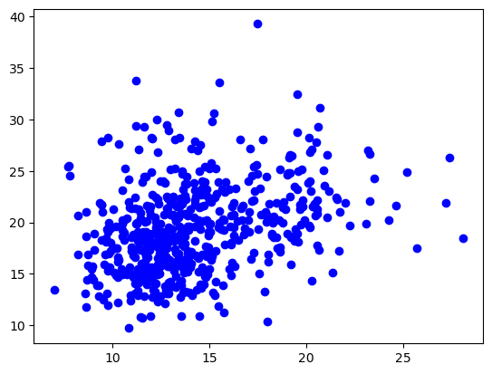
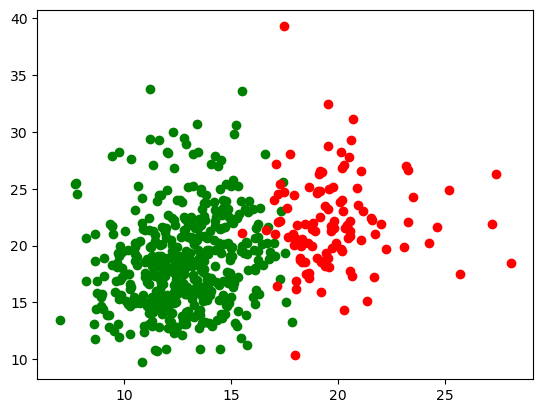
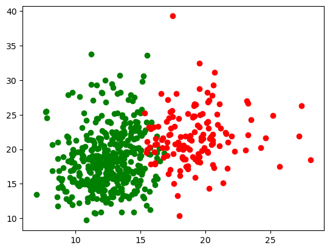

# K-Means and K-Medoids Clustering

## Data

#### Data description

<table border="1" class="dataframe">
  <thead>
    <tr style="text-align: right;">
      <th></th>
      <th>id</th>
      <th>radius_mean</th>
      <th>texture_mean</th>
      <th>perimeter_mean</th>
      <th>area_mean</th>
      <th>smoothness_mean</th>
      <th>compactness_mean</th>
      <th>concavity_mean</th>
      <th>concave points_mean</th>
      <th>symmetry_mean</th>
      <th>...</th>
      <th>texture_worst</th>
      <th>perimeter_worst</th>
      <th>area_worst</th>
      <th>smoothness_worst</th>
      <th>compactness_worst</th>
      <th>concavity_worst</th>
      <th>concave points_worst</th>
      <th>symmetry_worst</th>
      <th>fractal_dimension_worst</th>
      <th>Unnamed: 32</th>
    </tr>
  </thead>
  <tbody>
    <tr>
      <th>count</th>
      <td>5.690000e+02</td>
      <td>569.000000</td>
      <td>569.000000</td>
      <td>569.000000</td>
      <td>569.000000</td>
      <td>569.000000</td>
      <td>569.000000</td>
      <td>569.000000</td>
      <td>569.000000</td>
      <td>569.000000</td>
      <td>...</td>
      <td>569.000000</td>
      <td>569.000000</td>
      <td>569.000000</td>
      <td>569.000000</td>
      <td>569.000000</td>
      <td>569.000000</td>
      <td>569.000000</td>
      <td>569.000000</td>
      <td>569.000000</td>
      <td>0.0</td>
    </tr>
    <tr>
      <th>mean</th>
      <td>3.037183e+07</td>
      <td>14.127292</td>
      <td>19.289649</td>
      <td>91.969033</td>
      <td>654.889104</td>
      <td>0.096360</td>
      <td>0.104341</td>
      <td>0.088799</td>
      <td>0.048919</td>
      <td>0.181162</td>
      <td>...</td>
      <td>25.677223</td>
      <td>107.261213</td>
      <td>880.583128</td>
      <td>0.132369</td>
      <td>0.254265</td>
      <td>0.272188</td>
      <td>0.114606</td>
      <td>0.290076</td>
      <td>0.083946</td>
      <td>NaN</td>
    </tr>
    <tr>
      <th>std</th>
      <td>1.250206e+08</td>
      <td>3.524049</td>
      <td>4.301036</td>
      <td>24.298981</td>
      <td>351.914129</td>
      <td>0.014064</td>
      <td>0.052813</td>
      <td>0.079720</td>
      <td>0.038803</td>
      <td>0.027414</td>
      <td>...</td>
      <td>6.146258</td>
      <td>33.602542</td>
      <td>569.356993</td>
      <td>0.022832</td>
      <td>0.157336</td>
      <td>0.208624</td>
      <td>0.065732</td>
      <td>0.061867</td>
      <td>0.018061</td>
      <td>NaN</td>
    </tr>
    <tr>
      <th>min</th>
      <td>8.670000e+03</td>
      <td>6.981000</td>
      <td>9.710000</td>
      <td>43.790000</td>
      <td>143.500000</td>
      <td>0.052630</td>
      <td>0.019380</td>
      <td>0.000000</td>
      <td>0.000000</td>
      <td>0.106000</td>
      <td>...</td>
      <td>12.020000</td>
      <td>50.410000</td>
      <td>185.200000</td>
      <td>0.071170</td>
      <td>0.027290</td>
      <td>0.000000</td>
      <td>0.000000</td>
      <td>0.156500</td>
      <td>0.055040</td>
      <td>NaN</td>
    </tr>
    <tr>
      <th>25%</th>
      <td>8.692180e+05</td>
      <td>11.700000</td>
      <td>16.170000</td>
      <td>75.170000</td>
      <td>420.300000</td>
      <td>0.086370</td>
      <td>0.064920</td>
      <td>0.029560</td>
      <td>0.020310</td>
      <td>0.161900</td>
      <td>...</td>
      <td>21.080000</td>
      <td>84.110000</td>
      <td>515.300000</td>
      <td>0.116600</td>
      <td>0.147200</td>
      <td>0.114500</td>
      <td>0.064930</td>
      <td>0.250400</td>
      <td>0.071460</td>
      <td>NaN</td>
    </tr>
    <tr>
      <th>50%</th>
      <td>9.060240e+05</td>
      <td>13.370000</td>
      <td>18.840000</td>
      <td>86.240000</td>
      <td>551.100000</td>
      <td>0.095870</td>
      <td>0.092630</td>
      <td>0.061540</td>
      <td>0.033500</td>
      <td>0.179200</td>
      <td>...</td>
      <td>25.410000</td>
      <td>97.660000</td>
      <td>686.500000</td>
      <td>0.131300</td>
      <td>0.211900</td>
      <td>0.226700</td>
      <td>0.099930</td>
      <td>0.282200</td>
      <td>0.080040</td>
      <td>NaN</td>
    </tr>
    <tr>
      <th>75%</th>
      <td>8.813129e+06</td>
      <td>15.780000</td>
      <td>21.800000</td>
      <td>104.100000</td>
      <td>782.700000</td>
      <td>0.105300</td>
      <td>0.130400</td>
      <td>0.130700</td>
      <td>0.074000</td>
      <td>0.195700</td>
      <td>...</td>
      <td>29.720000</td>
      <td>125.400000</td>
      <td>1084.000000</td>
      <td>0.146000</td>
      <td>0.339100</td>
      <td>0.382900</td>
      <td>0.161400</td>
      <td>0.317900</td>
      <td>0.092080</td>
      <td>NaN</td>
    </tr>
    <tr>
      <th>max</th>
      <td>9.113205e+08</td>
      <td>28.110000</td>
      <td>39.280000</td>
      <td>188.500000</td>
      <td>2501.000000</td>
      <td>0.163400</td>
      <td>0.345400</td>
      <td>0.426800</td>
      <td>0.201200</td>
      <td>0.304000</td>
      <td>...</td>
      <td>49.540000</td>
      <td>251.200000</td>
      <td>4254.000000</td>
      <td>0.222600</td>
      <td>1.058000</td>
      <td>1.252000</td>
      <td>0.291000</td>
      <td>0.663800</td>
      <td>0.207500</td>
      <td>NaN</td>
    </tr>
  </tbody>
</table>

8 rows × 32 columns

#### Data Distribution

Dimensions used for plotting are - `radius_mean` and `texture_mean` in all the graphs

## K-Means

- K-means is a **partitioning clustering** algorithm that divides data into **K clusters**, where K is a predefined number of clusters. 
- The goal is to **minimize the sum of squared distances** between data points and the centroid of their assigned cluster. 
- The key steps of the K-means algorithm are as follows:

    - **Initialization:** Randomly select K initial cluster centroids.
    - **Assignment:** Assign each data point to the nearest centroid, forming K clusters.
    - **Update:** Recalculate the centroids for each cluster based on the mean of the data points assigned to that cluster.
    - **Repeat** steps 2nd and 3rd until convergence (i.e., until centroids no longer change significantly).

- K-means is **sensitive to the initial choice of centroids** and can be **influenced by outliers.** 
- It works well when clusters are approximately spherical and have similar sizes.

## K-Medoids

- K-medoids is a **variant of K-means** that is more **robust to outliers** and has different objectives. 
- Instead of using the mean of data points as the cluster center (centroid), K-medoids uses the medoid, which is the data point within a cluster that has the smallest sum of distances to all other data points in the same cluster. 
- The key steps of the K-medoids algorithm are as follows:

    - **Initialization:** Select K initial medoids (data points) either randomly or using a smarter initialization strategy.
    - **Assignment:** Assign each data point to the nearest medoid, forming K clusters.
    - **Update:** For each cluster, compute the medoid by selecting the data point that minimizes the total distance to other data points within the cluster.
    - **Repeat** steps 2nd and 3rd until convergence or a predefined number of iterations.

- K-medoids is **less sensitive to outliers** and can handle non-spherical clusters and clusters with varying sizes better than K-means. 
- It is a good choice when the data has noise or when you want more robust cluster centers.

